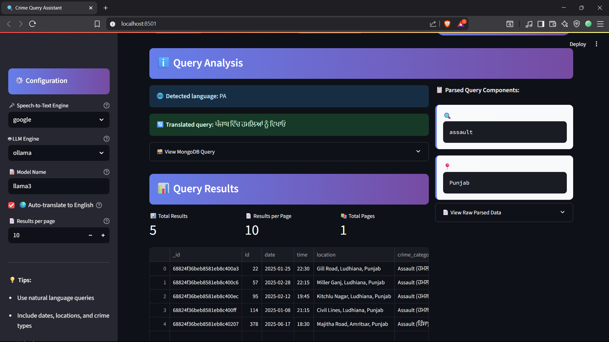
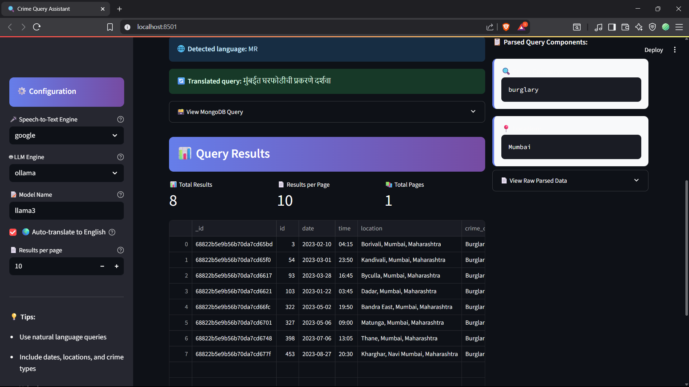
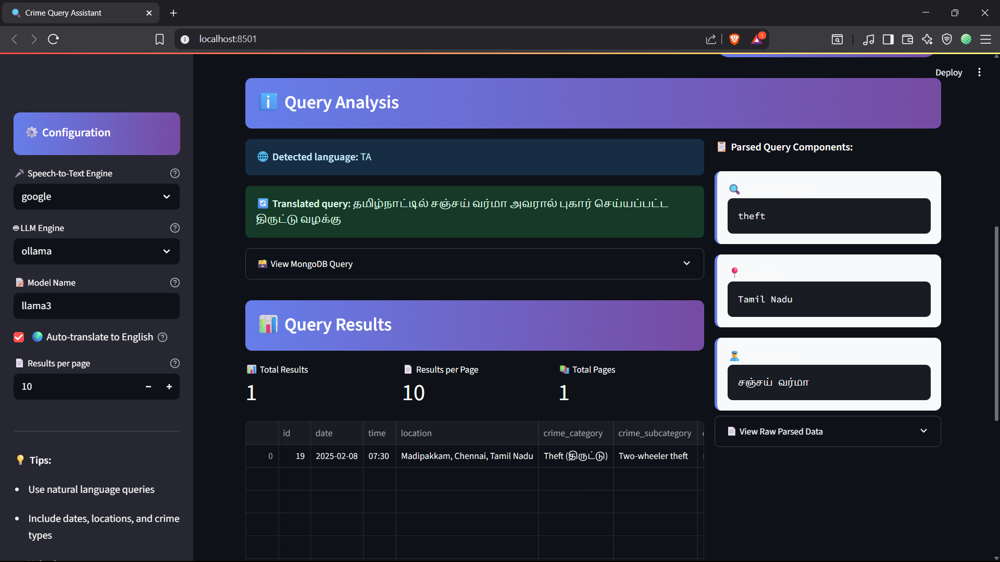

# Crime Query Assistant

A multilingual, voice-enabled crime data query application using Streamlit, MongoDB, and Python. Query crime data through natural language using voice or text, with support for over 12 languages and intelligent parsing.


## Preview

Below are sample screenshots showing key parts of the app:


*Assaults in Punjab*


*Burglary in Mumbai*


*Theft complait filed by Sanjay Verma in Tamil Nadu*


## Features

### Voice and Text Input
- Real-time speech-to-text transcription
- Preview and confirm transcribed query
- Option to retry or edit input before search

### Multilingual Support
- Supports 12+ languages including English, Hindi, Telugu, Tamil, Bhojpuri, Urdu

### Smart Crime Search
- Natural language parsing using LLMs
- Partial/fuzzy matching
- Synonym handling and transliteration
- Language auto-detection

### Query Result Handling
- Displays result count
- Pagination with navigation
- Export results as CSV or JSON
- Handles null or empty fields gracefully

### Modular Architecture
- Plug-and-play support for OpenAI and Ollama models
- Compatible with sparse or full JSON datasets
- Flexible storage using MongoDB

---

## Example Queries

### English
- Show all theft cases in Berlin since February 15
- Find burglary cases in Mumbai with open status

### Hindi
- दिल्ली में फरवरी से अब तक की चोरी दिखाओ
- खुली स्थिति वाले धोखाधड़ी के मामले दिखाएं

### Telugu
- హైదరాబాద్‌లో ఫిబ్రవరి నుండి దొంగతనాలు చూపించండి
- ముంబైలో తెరిచిన స్థితిలో ఉన్న మోసం కేసులు చూపించండి

---

## Quick Start

```bash
git clone <repository-url>
cd crime-query-assistant

pip install -r requirements.txt

cp config.py.example config.py  # Edit with your settings

Ingest demo data
python data/ingest_to_mongo.py data/tt_crime_dataset_merged.json

streamlit run main.py
```

See `INSTALL.md` for detailed setup instructions.

---

## Configuration

```python
# MongoDB
MONGODB_URI = "mongodb://localhost:27017/"
MONGODB_DB_NAME = "crime_database"
MONGODB_COLLECTION_NAME = "crime_records"
```

- STT Engines: Google Speech-to-Text (online) or OpenAI Whisper (local)
- LLM Engines: OpenAI (API key required) or Ollama (runs locally)

---

## Testing

```bash
python test_core_features.py
python test_enhanced_features.py
```

Covers:
- Core feature validation
- Pagination and multilingual support
- Data parsing and integration tests

---

## Deployment

### Local
```bash
streamlit run main.py
```

### Production
1. Configure MongoDB (local or Atlas)
2. Set environment variables and secrets
3. Deploy with Docker, Heroku, or preferred platform

---

## Troubleshooting

**Microphone Not Working**
- Check browser permissions and device settings

**MongoDB Connection Failed**
- Ensure MongoDB is running and config values are correct

**STT Issues**
- Google: Verify internet connection
- Whisper: Ensure model files exist and audio input is valid

**LLM Errors**
- Ollama: Confirm model is installed and running
- OpenAI: Check API key and rate limits

---

## Support

1. Review the installation guide
2. Check the troubleshooting section
3. Browse existing GitHub issues
4. Create a new issue with logs or screenshots if needed

---

Built by Ninad Dhatrak
